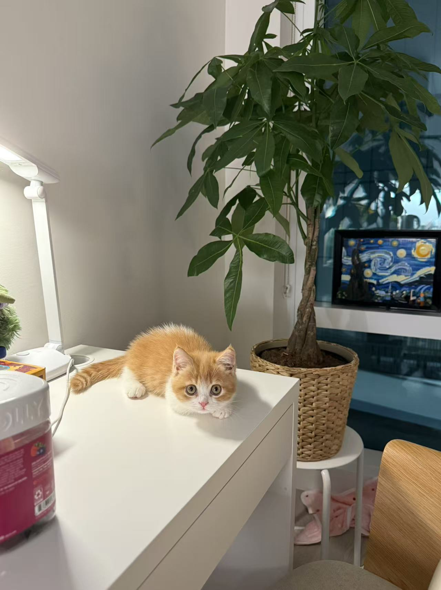

Hi! I’m Yilin Cai from Shanghai, China. I’m currently a Master’s student in Biostatistics at Columbia University in the City of New York. I earned my undergraduate degree from UCLA, where I majored in Computational and Systems Biology and minored in Statistics and Data Science.

Outside of school, I love traveling, singing, and playing badminton. I also enjoy taking care of my flowers and plants at home, and I have a cat who always keeps things lively!

Here's a picture of my cat:

